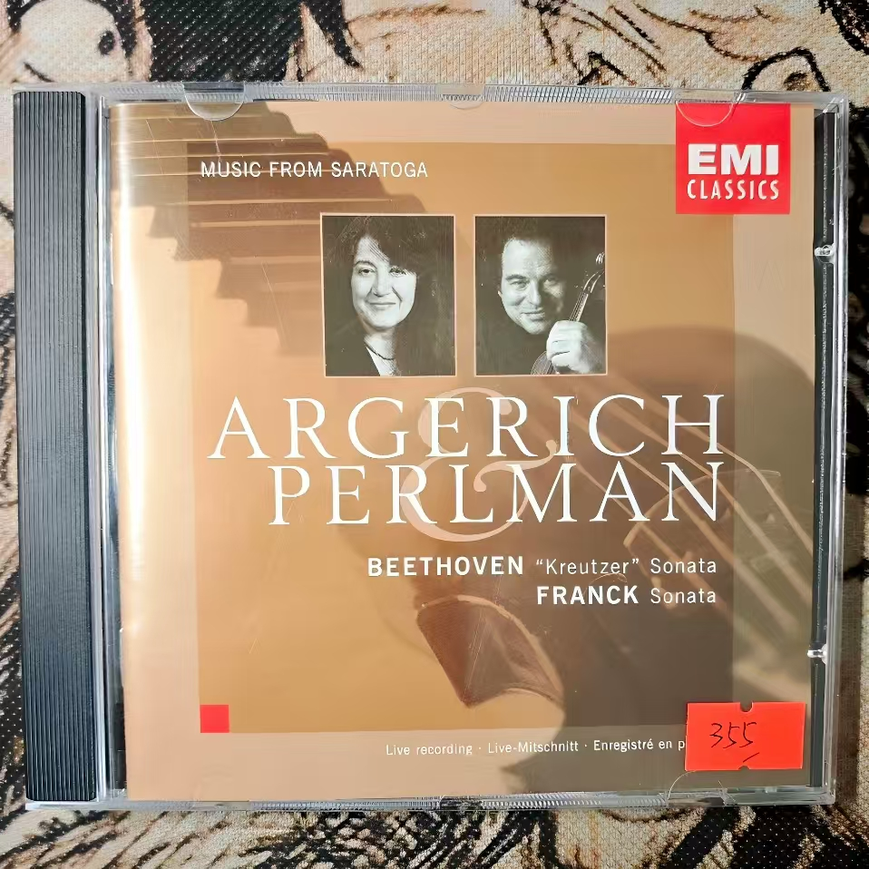

# ARGERICH PERLMAN BEETHOVEN & FRANCK Sonata

### 曲目
Sonata for piano and violin No. 9 in A major, Op. 47 "Kreutzer" - Beethoven

Violin Sonata in A major - Franck
### 演奏家
Argerich-阿格里奇(piano)

Perlamn-帕尔曼(violin)
### 作曲家
Beethoven, Franck
### 风格
classic
### 数量
1
### 来源
Music Store 北京王府井
### 附
带签名.

这是第一次在北京找到Franck的作品, 第二次是在芳草地的Echo Records.

cd介绍上贴着店员小哥写的介绍, 只有'阿格里奇'四个字是粗黑色油墨字迹, 其余用蓝色签字笔书写. 我告诉他我爱听Cory Wong, 他觉得挺不错, 可惜那张没出过CD. 走之前他推荐我<蓦然回首>的OST, 还在店内播放, 我表示没看过不会买, 他说'谁他妈让你买了, 我是让你听!'... 

这个店挺贵的.

26年初又仔细看了一下常听的Franck Violin Sonata版本, 才发现钢琴也是阿格里奇弹的.
