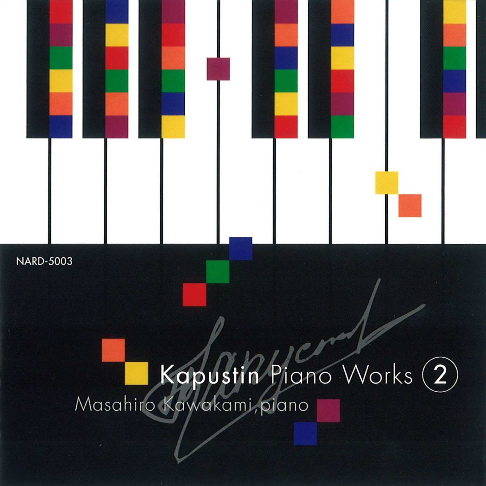

# Kapustin Piano Works 2

### 曲目
Ten Bagatelles Op. 59

Berceuse Op. 65

Humoresque Op. 75

Sonatina Op. 100

Paraphrase on "Aquarela do Brasil" by Ary Barroso Op. 188
### 演奏家
Masahiro Kawakami-川上 昌裕
### 作曲家
Kapustin
### 风格
classic(jazz)
### 数量
1
### 来源
Tower Records 涩谷 东京
### 附
中古品.

付钱的时候有填信息享优惠环节, 我跟店员说我得编一个日本名字和地址, 他说'はいはいOKOK', 最后优惠了5%.
