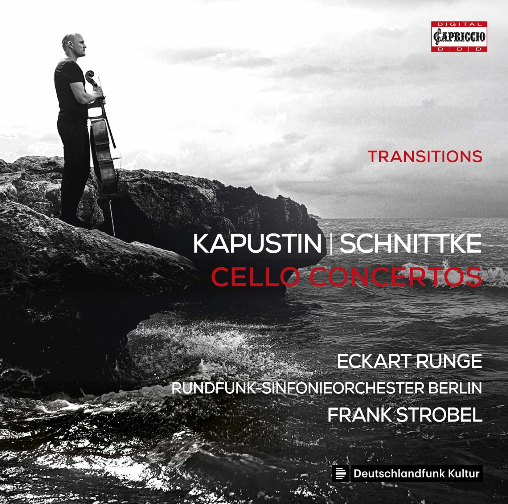

# KAPUSTIN | SCHNITTKE CELLO CONCERTOS

### 曲目
Concerto for cello and orchestra no. 1, Op. 85 - Kapustin

Concerto for cello and orchestra no. 1 - Schnittke
### 演奏家
Eckart Runge(cello) 领衔

Rundfunk-Sinfonieorchester Berlin-柏林广播交响乐团

Frank Strobel(conductor) 
### 作曲家
Kapustin, Schnittke
### 风格
classic(jazz)
### 数量
1
### 来源
Tower Records 涩谷 东京
### 附
附纸套.

付钱的时候有填信息享优惠环节, 我跟店员说我得编一个日本名字和地址, 他说'はいはいOKOK', 最后优惠了5%.
