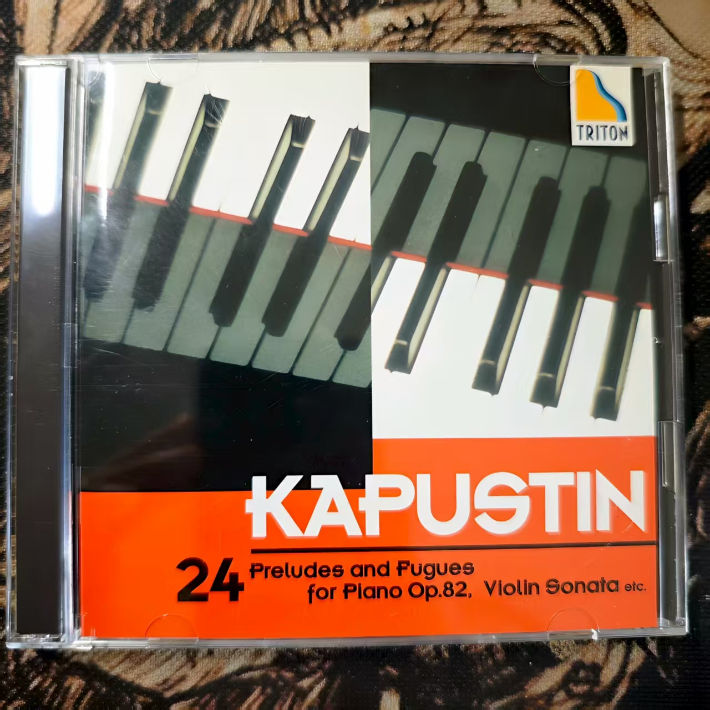

# Kapustin 24 Preludes and Fugues for Piano Op.82, Violin Sonata etc

### 曲目
24 Preludes and Fufues for Piano Op.82

Elegy for Cello and Piano Op.96

Burlesque for Cello and Piano Op.97

Nearly Waltz for Cello and Piano Op.98

Violin Sonata Op.70
### 演奏家
Nikolai Kapustin(piano) 领衔

Alexander Zagorinsky(cello)

Alexander Chernov(violin)
### 作曲家
Kapustin
### 风格
classic(jazz)
### 数量
1
### 来源
Tower Records 涩谷 东京
### 附
中古品.

Kapustin本人演奏.

这张cd的介绍书特别容易拿出来.

付钱的时候有填信息享优惠环节, 我跟店员说我得编一个日本名字和地址, 他说'はいはいOKOK', 最后优惠了5%.
