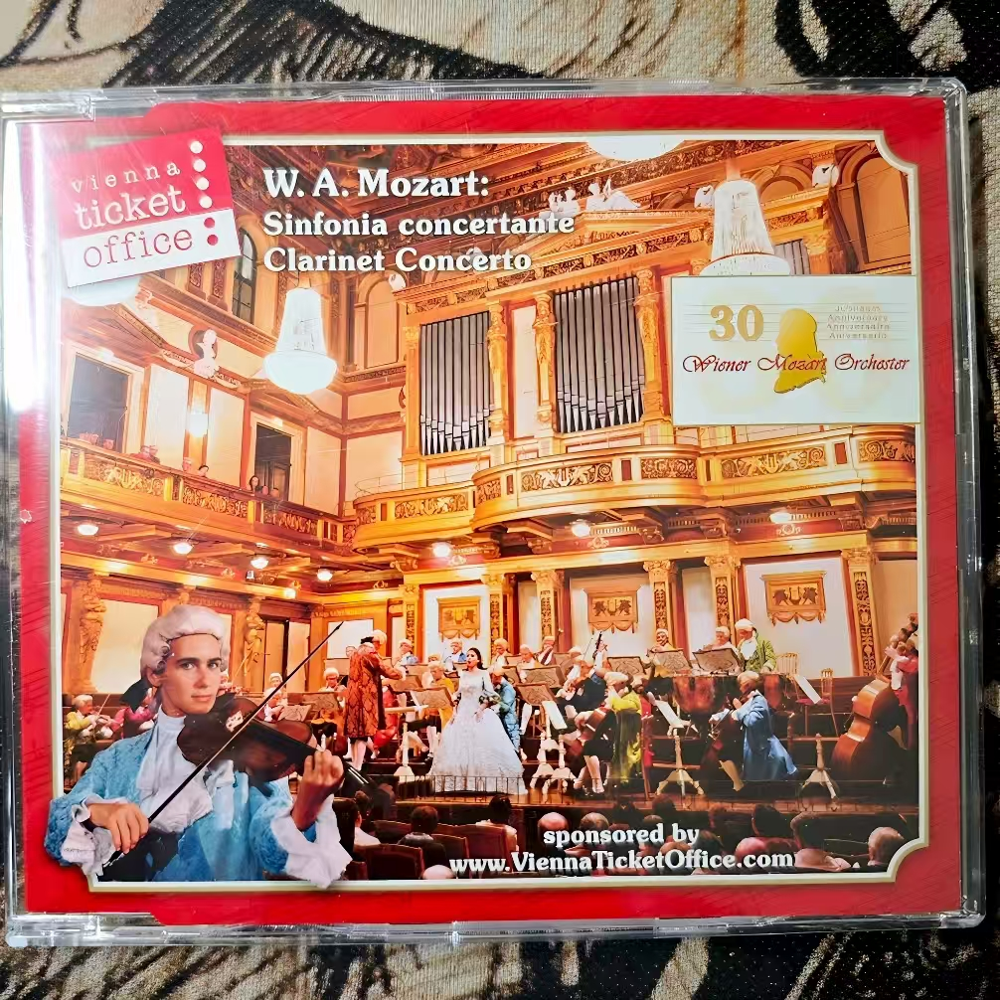

# W.A.Mozart: Sinfonia concertante Clarinet Concerto

### 曲目
Sinfonia concertante, K. 364

Clarinet Concerto in A Major, K. 622
### 演奏家
Wiener Mozart Orchester-维也纳莫扎特交响乐团
### 作曲家
Mozart
### 风格
classic
### 数量
2
### 来源
2017年欧洲旅行, 维也纳金色大厅观演赠送
### 附
保存方式比较尴尬, 光盘存储面向外.
