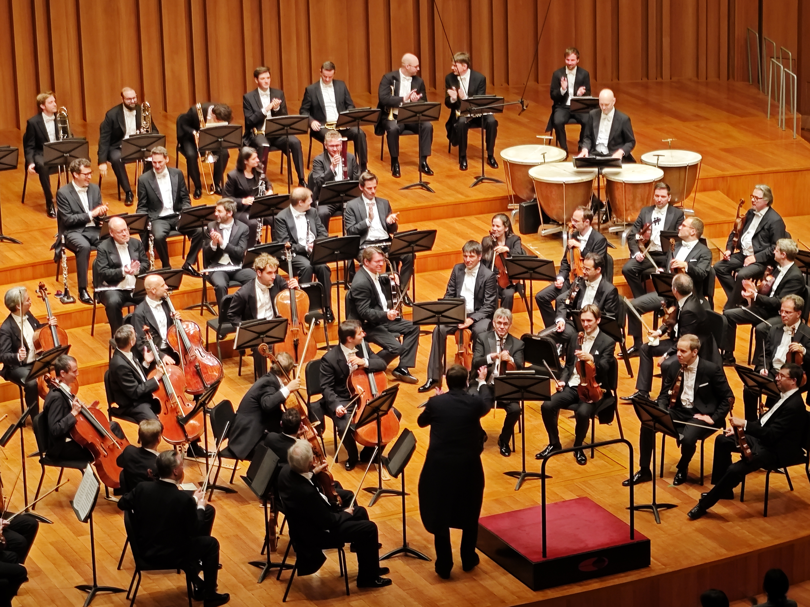
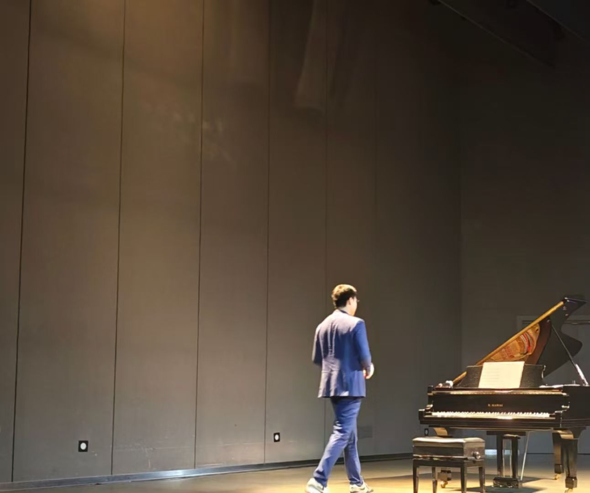
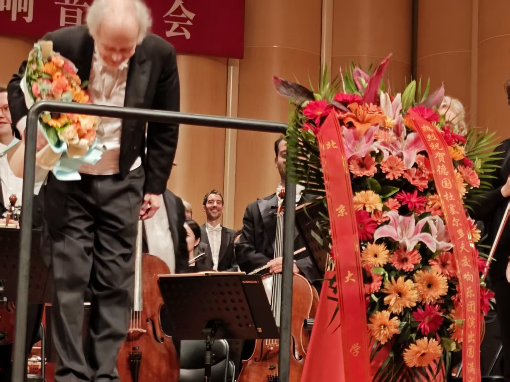
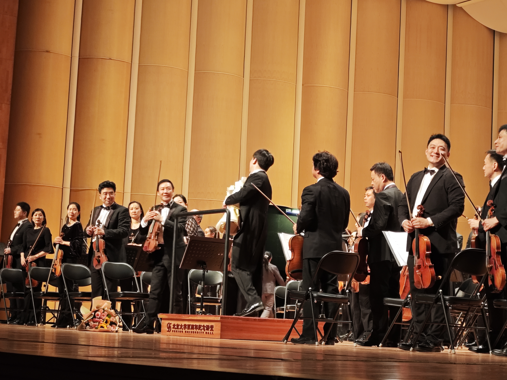
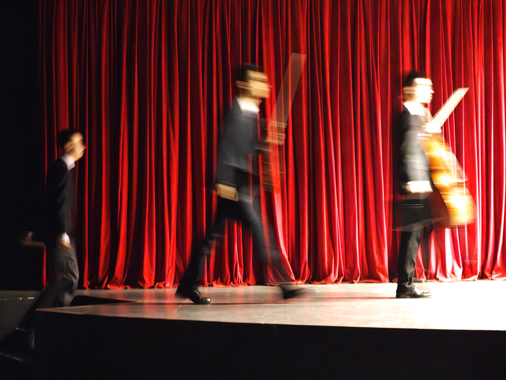
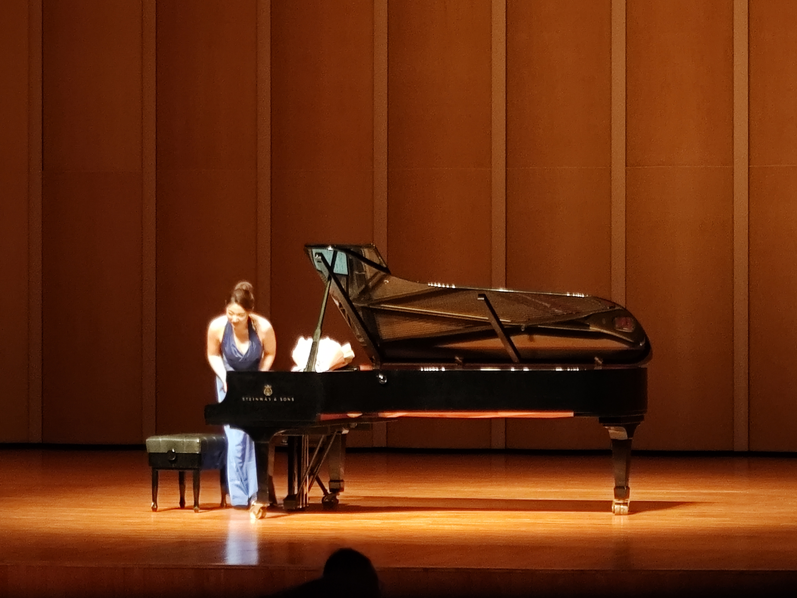
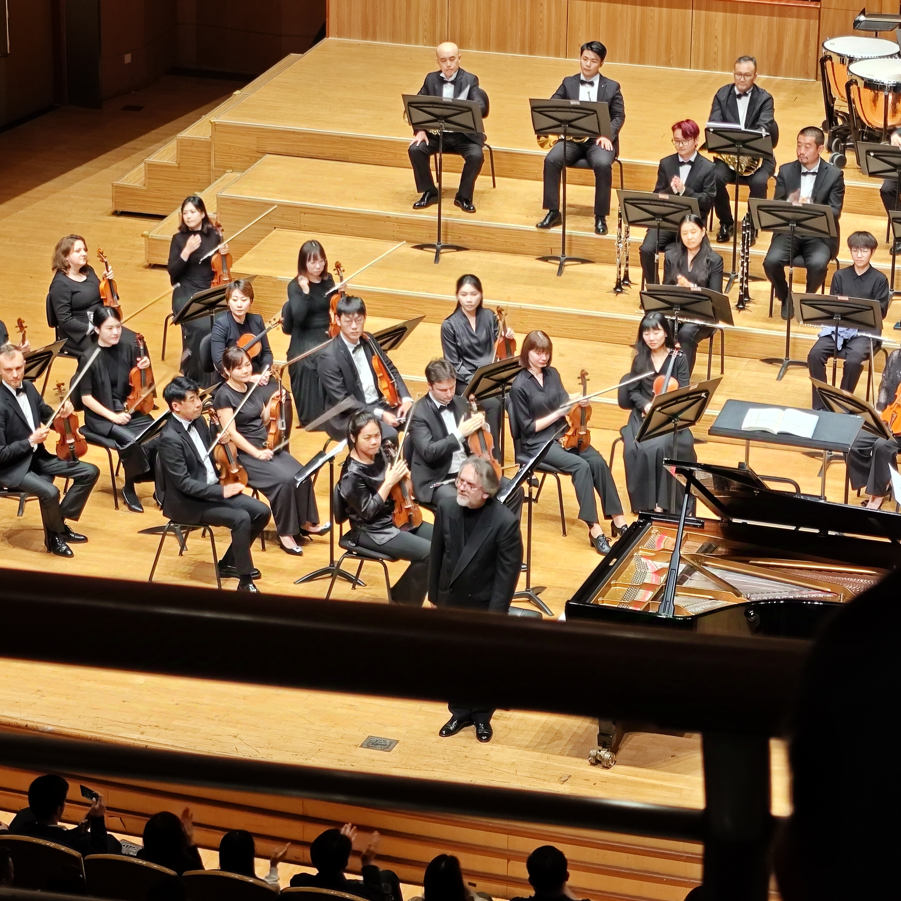
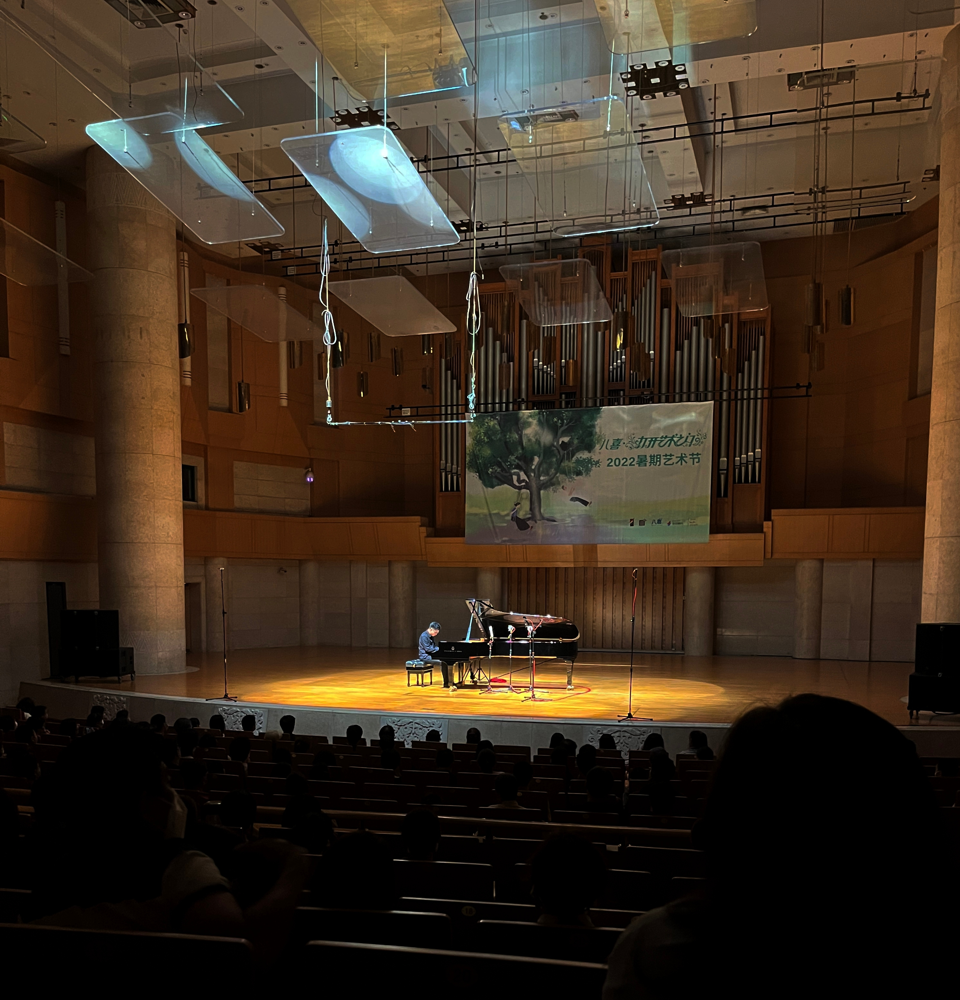

## 关于音乐会的记录
#### 11.26.2025
- **Bruckner: Symphony No. 5 in B-flat major**
- *Christian Thielemann & Vienna Philharmonic Orchestra*
- 国家大剧院, 音乐厅

#### 06.22.2025
- **Jazz Piano Concert——暗流**
  - 久远之地 Long Ago and far Away
  - 秋 Fall
  - 自动主义 Automatism
  - 巫师 The Sorcerer
  - 我的宝贝露比 Ruby My Dear
  - 宁的节奏 Rhythm-A-Ning
  - *—INTERMISSION—*
  - 贝丝 Beth
  - 记得 Remember
  - 往日重现 Same Thing Again
  - 布鲁斯 Blues
  - 阳光大道 On the Sunny Side of the Street
  - 你就是一切 All the Things You Are
- *苏绍南*
- 北京大学百周年纪念讲堂, 李莹厅

#### 05.13.2025
- **Mahler: Symphony No. 9 in D major**
- *Adam Fischer & Düsseldorf Symphony Orchestra*
- 北京大学百周年纪念讲堂, 观众厅

#### 03.09.2025
- **2025“春之声”**
  - Shostakovich: Festive Overture, Op. 96
  - Sviridov: The Snowstorm
  - *—INTERMISSION—*
  - Mahler: Symphony No. 5 in C sharp minor
- *李昊冉 & 北京交响乐团*
- 北京大学百周年纪念讲堂, 观众厅

#### 12.15.2024
- **刘晓禹钢琴独奏音乐会**
  - Tchaikovsky: The Seasons, Op. 37a (excerpt)
  - ~~Mendelssohn & Rachmaninoff: A Midsummer Night‘s Dream: Scherzo(Arr.)~~
  - Tchaikovsky: Swan Lake: Dance of the Four Swans(Arr. Wild for Piano)
  - Scriabin: Sonata No. 4 in F-sharp major, Op. 30
  - *—INTERMISSION—*
  - Tchaikovsky: The Seasons, Op. 37a (excerpt) 
  - Prokofiev: Piano Sonata No. 7 in B-flat major, Op. 83
- *刘晓禹(Bruce Liu)*
- 国家大剧院, 音乐厅

#### 11.23.2024
- **Klavio室内乐音乐会**
  - Braga: Angel's Serenade
  - Franck: Violin Sonata in A Major, FWV 8
  - Clara Schumann: 3 Romances, Op. 22
  - Smetana: Piano Trio in G Minor, Op. 15
  - Beethoven: Piano Trio No. 3 in C Minor, Op. 1/3
  - Chopin: Cello Sonata in G minor, Op. 65
  - *—INTERMISSION—*
  - Beethoven: Violin Sonata No. 1 in D Major, Op. 12/1
  - Grieg: Violin Sonata No. 3 in C Minor, Op. 45
  - Dvořák: Piano Trio No. 3 in F Minor, Op. 65
  - Dvořák: Piano Quintet No. 2 in A Major, Op. 81
  - Debussy: Cello Sonata in D Minor, L. 135
  - Hindemith: Viola Sonata in F Major, Op. 11/4
- *PKU 钢琴社 & 提琴社*
- 北京大学新太阳学生活动中心, B101

#### 10.20.2024
- **自图画深处——罗维钢琴独奏音乐会**
  - Granados: 12 Spanish Dances, Op. 37, No. 2 "Oriental"
  - Albéniz: Iberia, Book 1
  - Albéniz: Suite Española No. 1, Op. 47, No. 1 "Granada"
  - Debussy: Suite bergamasque, L. 75, III. Clair de lune
  - Petitgirard: Journey to the West
  - *—INTERMISSION—*
  - Mussorgsky: Pictures at an Exhibition
- *罗维*
- 北京大学百周年纪念讲堂, 观众厅

#### 10.15.2024
- **“音画百讲·壶畔新声”秋季音乐会**
  - Beethoven: Violin Sonata No. 3 in G Major, Op. 30, I. Allegro
  - Ešenvalds: Only in Sleep
  - Fauré: Sicilienne, Op. 78
  - Vlasov: Bossa Nova
  - J.S. Bach: Violin Sonata No. 1 in G Minor, BWV 1001
  - Gardel: Por una Cabeza
  - Giraud: Sous le ciel de Paris
  - Haydn: String Quartet No. 5 in D Major, Op. 64, "The Lark", I. Allegro moderato
  - McCartney: Yesterday
  - 黄依伊(Yiyi Huang): Tango de café
  - Gärtner: Viennese Melody (arr. Kreisler)
  - Franck: Violin Sonata in A Major, FWV 8, II. Allegro
- *PKU 提琴社, 钢琴社, 手风琴社, 口琴社, 元声室内合唱团 & BNU 提琴协会*
- 北京大学百周年纪念讲堂, 咖啡厅

#### 09.28.2024
- **“完全柴可夫斯基”2024爱乐汇交响乐团音乐季**
  - Tchaikovsky: Piano Concerto No. 1 in B-flat Minor, Op. 23
  - Tchaikovsky: Symphony No. 3 in D Major, Op. 29 "Polish"
- *Konstantin Scherbakov & 刘炬 & 北京爱乐汇交响乐团*
- 北京音乐厅

#### 08.18.2022
- **自由飞翔——爵士钢琴家阿布独奏音乐会**
  - Kapustin: 8 Concert Etudes, Op. 40
  - A Bu: 在梦中睡, Fantasie "Sleeping in a Dream", Op. 7
  - Kapustin: Variations, Op. 41
  - *—INTERMISSION—*
  - Garner: Misty (Arr. A Bu)
  - Corea: Armando's Rhumba
  - A Bu: *Improvisation*
  - A Bu: 第一钢琴奏鸣曲“松”, Piano Sonata No. 1 "Pinus"
- *阿布 A Bu*
- 中山公园音乐堂

