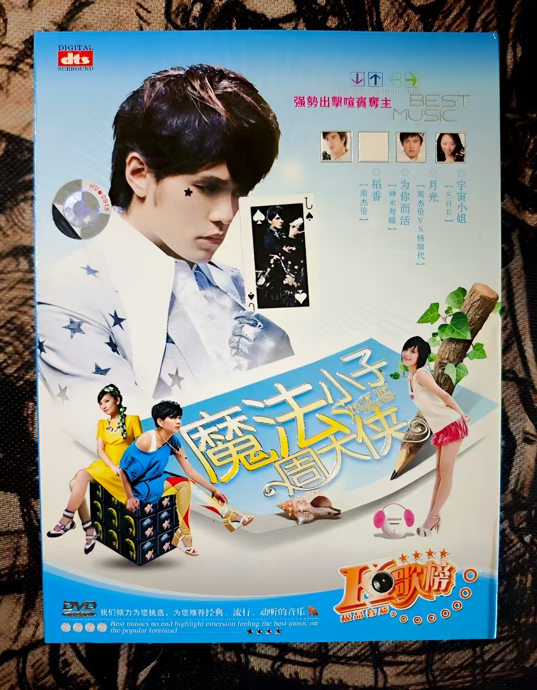

# 魔法小子周大侠

### 曲目
稻香

月光

宇宙小姐

摇滚怎么了

听我的

沿海公路的出口

想到和做到的

明天过后

画心

请留住你的脚步

下一个天亮

我爱烦恼

被爱伤害以后

爱一点

永远在身边

美好时光

女孩当自强

为你而活

牵强

梨花香

你不像她

夏日疯

离开悲伤

爱丫爱丫

陷入爱里面

男人KTV

两个人的寂寞

依赖

还是好朋友

风云决

传说

死而无憾

吻得太逼真

可以为你

校花

黄玫瑰

爱上你是一个错

嫁给我你会幸福

我爱的男人变了心

分手是不哭泣
### 歌手
周杰伦

神木与瞳

杨瑞代

SHE
### 原唱
无数人
### 编曲/作曲
无数人
### 风格
pop
### 数量
1
### 来源
未知
### 附
dvd, 古老但保存的很好.

封面对周杰伦以外的歌手的评价是'強勢出擊喧賓奪主'.
